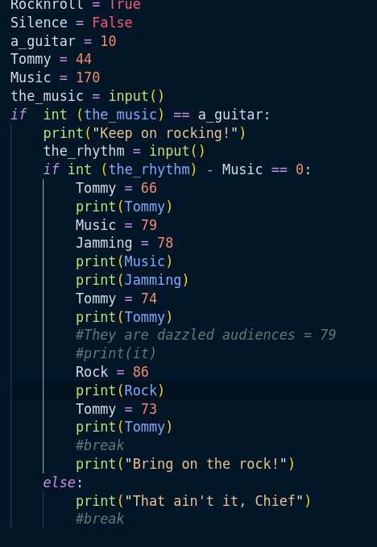
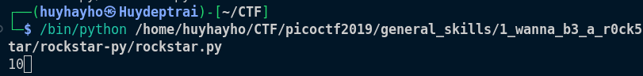
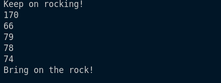

# 1_wanna_b3_a_r0ck5tar

## Descritption
> I wrote you another [song](https://jupiter.challenges.picoctf.org/static/b99c57e4274172bf3c93534b6d59632d/lyrics.txt). Put the flag in the picoCTF{} flag format

## Hints
> None

## Soulution
1. Wget [song](https://jupiter.challenges.picoctf.org/static/b99c57e4274172bf3c93534b6d59632d/lyrics.txt)
2. We've done a mus1c lesson before, but in this lesson, when we put lyrics.txt into rockstar, we won't be able to produce output. It's likely due to a code error, so we need to return it to a code language we understand.
3. So this is a link to return to code language: [Implementations](https://web.archive.org/web/20190522030819/https://codewithrockstar.com/code). In here i use `rockstar-py`. Follow the instructions included in README.md
4. Use `rockstar-py -i lyrics.txt` and we will have `output.py` file complied from rockstar code
5. We need fix bug:

- Run code:

  - When reading the code, we will realize that when the_music = a_guitar and = 10, the loop will continue.
  - And we will enter 170 to satisfy the_rhythm - music = 0 condition
6. Now we have a series of numbers below:

7. We have 2 methods to sovle this problem
   - Method 1: Here we are missing the number of the code "They are dazzled audiences", please reopen lyrics.txt and read carefully. We will have `Music is a billboard-burning razzmatazz!` so logically we will have `They are dazzled audiences` = Music. It turns out that the number to find is 79
   - Method 2: simpler when we can understand how rockstar code works. The 4 words 'is', 'are', 'was', 'were' mean the '=' sign, the following characters will have the same value as the number of digits. It follows that dazzled audiences will be equal to 79
8. We have final series number
> 66 79 78 74 79 86 73
>
> This is decimal number, so we have: BONJOVI

## Flag
> picoCTF{BONJOVI}

