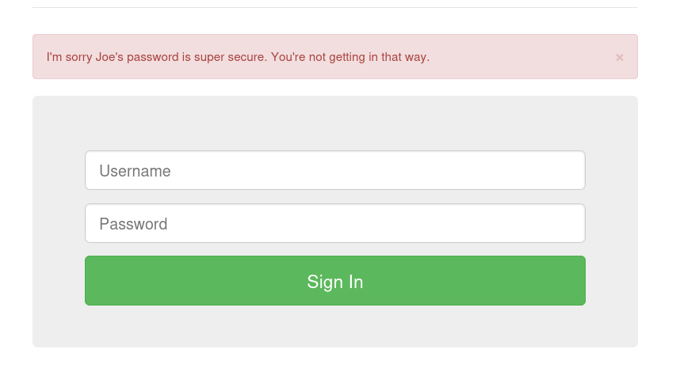
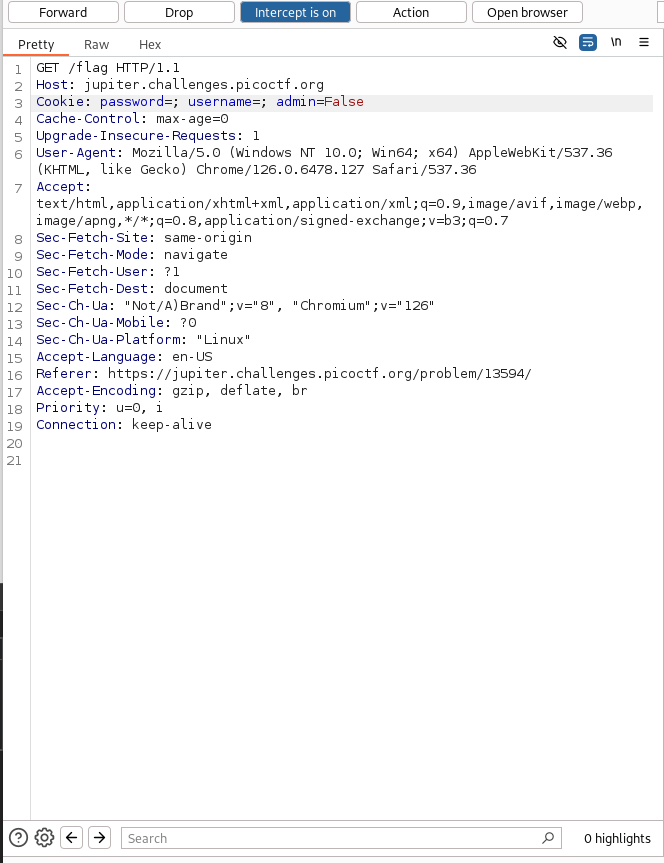
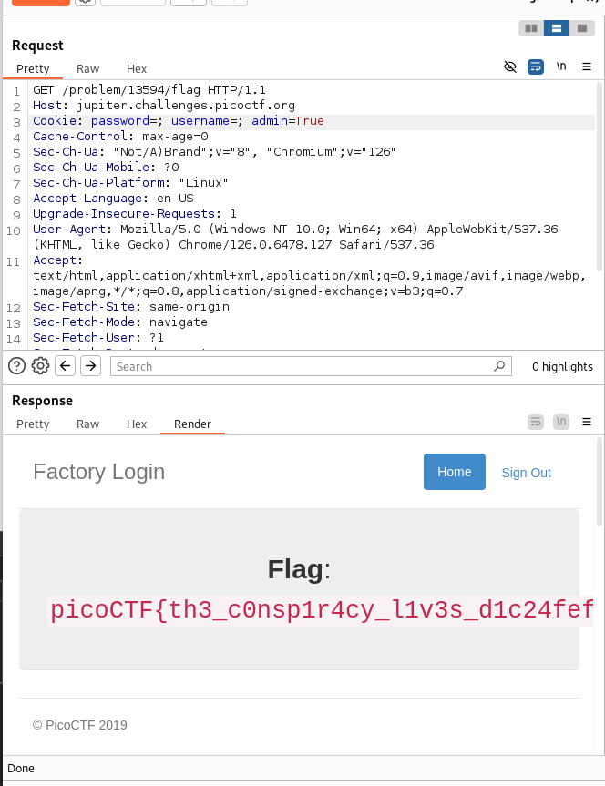

# logon

## Description
> The factory is hiding things from all of its users. Can you login as Joe and find what they've been looking at? `https://jupiter.challenges.picoctf.org/problem/13594/` [link](https://jupiter.challenges.picoctf.org/problem/13594/) or http://jupiter.challenges.picoctf.org:13594

## Hints
> Hmm it doesn't seem to check anyone's password, except for Joe's?

## Solution
1. Here we will see that only user Joe cannot log in and displays "I'm sorry Joe's password is super secure. You're not getting in that way.", other accounts can log in but there will be no flags.
> 
>
2. Now let's go to burpsuite to make some changes
   
3. As we can see, the value of admin is "False", so we need send it to repeater
> 

4. Change "False" to "True" and send. We will find the flag
> 

## Flag
> picoCTF{th3_c0nsp1r4cy_l1v3s_d1c24fef}

