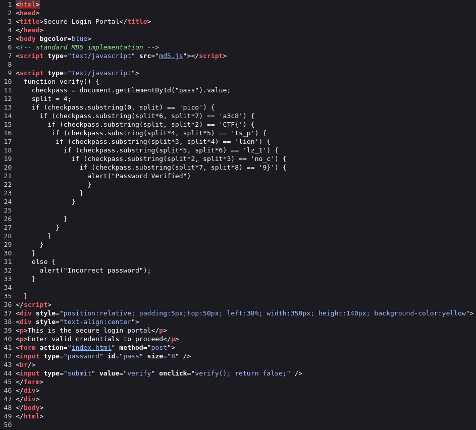
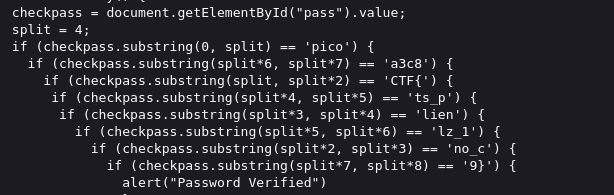

# dont-use-client-side

## Description
> Can you break into this super secure portal? https://jupiter.challenges.picoctf.org/problem/37821/ (link) or http://jupiter.challenges.picoctf.org:37821

## Hints
> Never trust the client

## Solution 
1. Visit the website by link, view selection source to see html
   
2. We have 2 methods to solve this problem
   1. When reading the code directly on the web, we can see the hint that the article is about, which is this paragraph
     
      - We can think of logic to rearrange the substrings in order from 0 to 8  
   2. Use `Wget https://jupiter.challenges.picoctf.org/problem/37821/` to dowload html to our device
      - Use `grep 'substring' index.html | sed "s/') {/\n/g" | sed "s/[[:space:]]*if (checkpass.substring(\(split\*\|\)//g" | sort -n | awk '{ printf $4 }' | tr -d "'"` to take flag

## Flag
> picoCTF{no_clients_plz_1a3c89}
