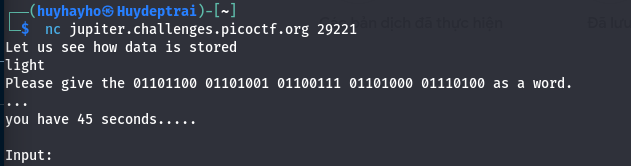

# Based

## Description
> To get truly 1337, you must understand different data encodings, such as hexadecimal or binary. Can you get the flag from this program to prove you are on the way to becoming 1337? `Connect with nc jupiter.challenges.picoctf.org 29221.`

## Hints
> I hear python can convert things.
> It might help to have multiple windows open.

## Solution
1. After connecting this port, we will receive a notification 
   >
   - We will use code python or tools in the internet to change number binary to text
2. Continue
   >
   - We change number octal to text
3. The last
   >
   - We change number hexal to text

## Flag
> Flag: picoCTF{learning_about_converting_values_00a975ff}