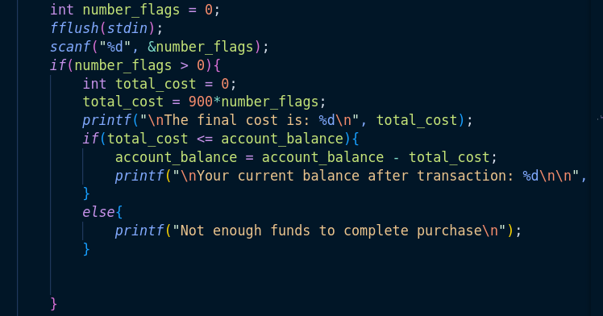

# flag_shop

## Description
> There's a flag shop selling stuff, can you buy a flag? (Source)[https://jupiter.challenges.picoctf.org/static/64e724ad327f83ad833d9c6baa072b1f/store.c]. Connect with `nc jupiter.challenges.picoctf.org 4906.`

## Hints
> Two's compliment can do some weird things when numbers get really big!

## Solution
1. First we need connect with `nc jupiter.challenges.picoctf.org 4906.`
2. In here we can see 3 options
   + Check Account Balance
   + Buy Flags
   + Exit
- Currently in our wallet we only have 1100, if we want to buy a flag we need to use 1337. Currently we can only go to Defintely not the flag Flag
- Because knockoff Flags cost 900 each, so we can just by 1, but then the remaining balance is 200 and we won't have enough 1337 to buy the flag
3. Now we will download the (Source)[https://jupiter.challenges.picoctf.org/static/64e724ad327f83ad833d9c6baa072b1f/store.c] and check what's inside
- As we can see in this code , variables are initialized as int and its size range is from -2,147,483,648 to 2,147,483,647. In option 2 - 1, if we buy the flag quantity larger than the range of the int variable after multiplying by 900 for each, it will result in overflow and result in a large negative number, then Logically, to calculate the current balance after purchase, the formula will be:
  > Account Balance - amount for each flag Flag = 1100 - negative number
  >
  > So Account Balance will be big positive number
4. So now we can buy 1337 flag

## Flag
> picoCTF{m0n3y_bag5_9c5fac9b}